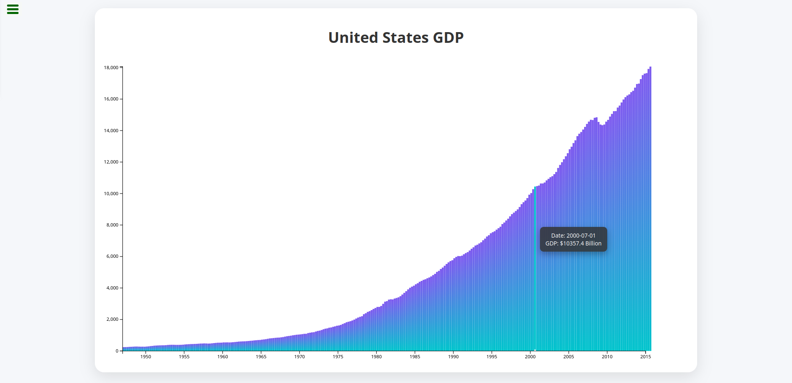

# United States GDP Bar Chart

This project is part of the **FreeCodeCamp Data Visualization Projects** challenge. It visualizes the United States GDP using **D3.js** in an interactive bar chart format.

## Features

- Interactive **bar chart** showing US GDP data from 1947 to present.  
- **Hover tooltips** displaying the date and GDP value for each bar.  
- Properly scaled **axes**.  
- Modern, clean gradient bars with smooth hover effects.  
- Each bar includes `data-date` and `data-gdp` attributes for FreeCodeCamp project tests.

## Technologies

- JavaScript (ES6)  
- D3.js v6  
- HTML5 & CSS3  

## Data Source

The dataset comes from [FreeCodeCamp's GDP Data](https://raw.githubusercontent.com/freeCodeCamp/ProjectReferenceData/master/GDP-data.json).  

Each data point contains:

- `date` (YYYY-MM-DD)  
- `GDP` (in billions USD)  

## Getting Started

1. **Clone the repository**:

    ```bash
    git clone https://github.com/dallatIkes/freeCodeCamp-d3-barchart.git
    cd freeCodeCamp-d3-barchart
    ```

2. **Open the project**:

   Open `index.html` in any modern browser (Chrome, Firefox, Edge).  

3. **Optional: Run with a local server**:

    ```bash
    npx serve
    ```

   Then navigate to `http://localhost:5000`.

## Project Structure

```
freeCodeCamp-d3-barchart/
│
├─ index.html
├─ style.css
├─ app.js
└─ README.md
```


## Screenshots



## License

This project is open source and available under the **MIT License**.

---

Built with ❤️ using **D3.js** for the FreeCodeCamp Data Visualization challenge.

